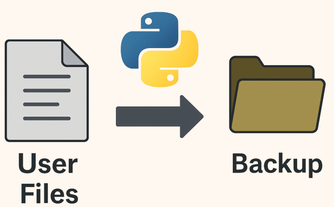

 <p><span align="left">
  
</span>

## backup user files on Unix-y OSes ##

These Python scripts recursively analyzes a given source directory, counts all files (excluding `.local` and `.cache` directories), calculates the total disk space used, and copies the directory structure and files to a specified target directory.

## Features

- Recursively walks through a directory
- Excludes `.local` and `.cache` directories
- Counts files and computes total disk space used
- Mirrors the source directory's structure and contents into a target directory
- Displays a summary of the operation

## Usage

Run the script from the command line:

```bash
python3 script.py
